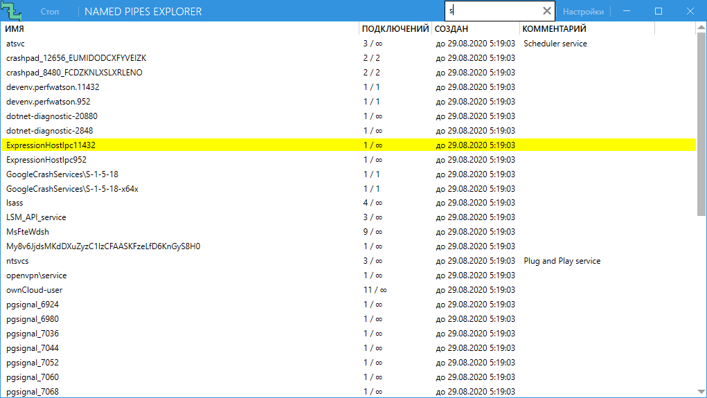

# PipeExplorer
A Windows named pipe monitoring GUI. Requires administrator priviledges to run.

## Features

- Displays name and number of active/maximum connections, like [pipelist.exe](https://docs.microsoft.com/en-us/sysinternals/downloads/pipelist) from [SysInternals Suite](https://docs.microsoft.com/en-us/sysinternals/) does, and creation timestamp as a bonus.
- Highlights newly created and removed pipes, like [Process Explorer](https://docs.microsoft.com/en-us/sysinternals/downloads/process-explorer) from SysInternals Suite does.
- Gives hints about well-known pipe names.

## Known issues

Since Windows doesn't keep timestamps of pipe creation, the creation timestamp is determined by the time the named pipe is first seen.

The named pipes that get quickly created and deleted (or deleted and re-created) between scans won't be noticed about at all.

## TODO

- ACL extraction and displaying.
- Window position save & restore.
- More/better hints (see the GetHintFor() function in Models/PipeModel.cs).
- Keep selected line in view when many named pipes gets created or deleted.